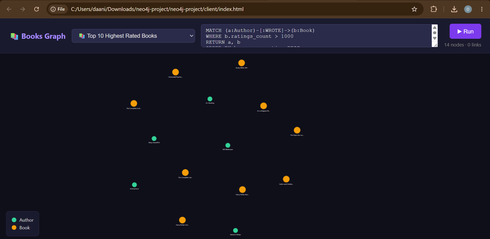
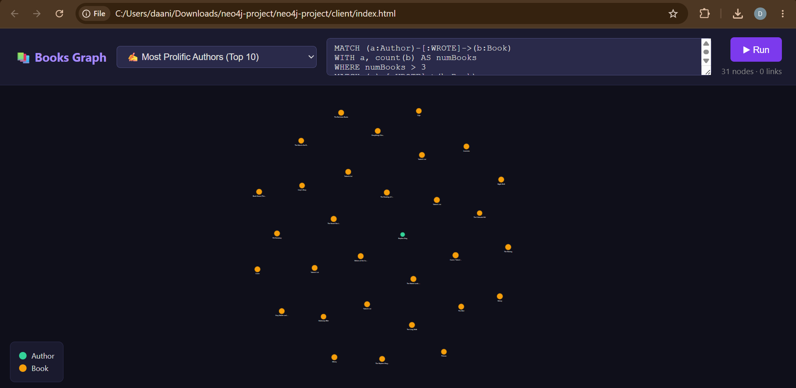
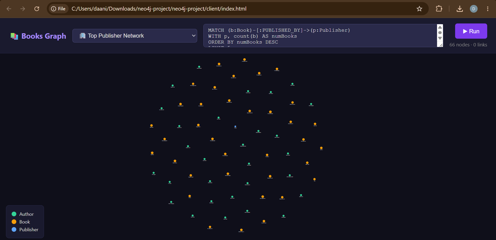
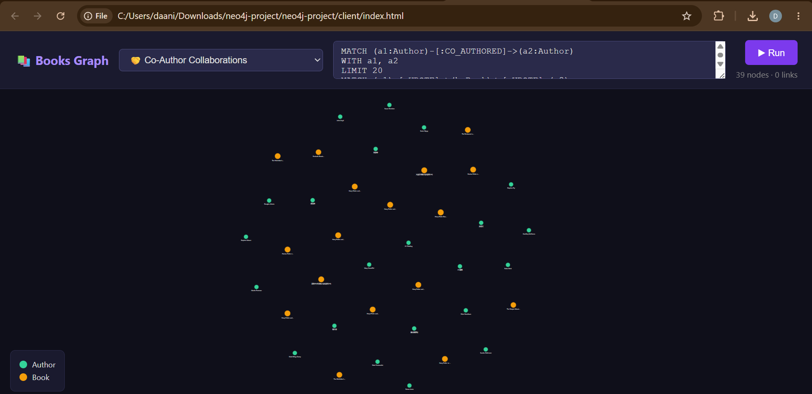
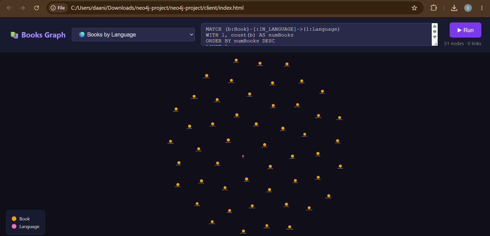
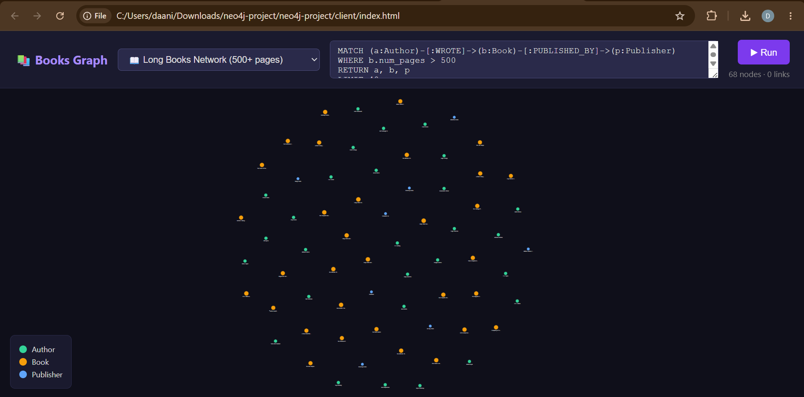

# 📚 Books Graph Explorer — Neo4j Project

## 1. Data Choice

I used the **GoodReads Books dataset** from Kaggle, which contains over 11,000 books scraped from GoodReads. I chose this dataset because books are naturally highly interconnected — authors write multiple books, publishers release many titles, books share languages, and authors frequently collaborate — making it an ideal fit for a graph database.

The dataset includes: book titles, authors, average ratings, page counts, ratings count, publication dates, publishers, and language codes.

## 2. Process

**Loading steps:**

1. Downloaded `books.csv` from Kaggle (11,127 rows)
2. Cleaned the data using a Python script:
   - Fixed a leading-space bug in the `num_pages` column header
   - Normalized invalid language codes to `unknown`
   - Stripped whitespace from all fields
   - Removed stray quotes from titles
3. Placed `books_clean.csv` into Neo4j's `import` folder
4. Ran `load.cypher` in Neo4j Browser to create constraints, indexes, nodes, and relationships

**Problems encountered:**

- The `num_pages` column had a leading space (`  num_pages`) causing import issues — fixed in the Python cleaning script
- Some language codes were actually ISBNs (bad data rows) — filtered those out
- Authors are stored as a single `/`-separated string, so splitting them required `UNWIND` in Cypher

## 3. Volume

```
MATCH (x) RETURN count(x) AS NumNodes;
MATCH ()-[r]->() RETURN count(r) AS NumRelationships;
```

| NumNodes | NumRelationships |
|----------|-----------------|
| 22678    | 64555           |

## 4. Variety

### Query 1 — Top 10 Highest Rated Books with their Authors
```cypher
MATCH (a:Author)-[:WROTE]->(b:Book)
WHERE b.ratings_count > 1000
RETURN a, b
ORDER BY b.average_rating DESC
LIMIT 10
```


---

### Query 2 — Most Prolific Authors
```cypher
MATCH (a:Author)-[:WROTE]->(b:Book)
WITH a, count(b) AS numBooks
WHERE numBooks > 3
MATCH (a)-[:WROTE]->(b:Book)
RETURN a, b
ORDER BY numBooks DESC
LIMIT 30
```


---

### Query 3 — Top Publisher Network
```cypher
MATCH (b:Book)-[:PUBLISHED_BY]->(p:Publisher)
WITH p, count(b) AS numBooks
ORDER BY numBooks DESC
LIMIT 5
MATCH (b:Book)-[:PUBLISHED_BY]->(p)
MATCH (a:Author)-[:WROTE]->(b)
RETURN a, b, p
LIMIT 40
```


---

### Query 4 — Co-Author Collaborations
```cypher
MATCH (a1:Author)-[:CO_AUTHORED]->(a2:Author)
WITH a1, a2
LIMIT 20
MATCH (a1)-[:WROTE]->(b:Book)<-[:WROTE]-(a2)
RETURN a1, a2, b
```


---

### Query 5 — Books by Language Distribution
```cypher
MATCH (b:Book)-[:IN_LANGUAGE]->(l:Language)
WITH l, count(b) AS numBooks
ORDER BY numBooks DESC
LIMIT 5
MATCH (b:Book)-[:IN_LANGUAGE]->(l)
RETURN b, l
LIMIT 50
```


---

### Query 6 — Long Books Network (500+ pages)
```cypher
MATCH (a:Author)-[:WROTE]->(b:Book)-[:PUBLISHED_BY]->(p:Publisher)
WHERE b.num_pages > 500
RETURN a, b, p
LIMIT 40
```


---

## 5. Bells and Whistles

- **Preset query dropdown** — instead of typing raw Cypher, users pick from 6 pre-built queries from a dropdown menu. This makes the app user-friendly and demonstrates real UX thinking.
- **Color-coded nodes by label** — Books (amber), Authors (green), Publishers (blue), Languages (pink) are visually distinct at a glance.
- **Node size encodes data** — Book nodes are sized by their `average_rating`, so highly-rated books appear larger in the visualization.
- **Relationship arrows with labels** — Every edge shows its type (`WROTE`, `PUBLISHED_BY`, etc.) and is color-coded to match its source node type.
- **Hover tooltips** — Hovering over any node shows its properties (title, rating, page count, etc.) in a clean tooltip overlay.
- **Zoom & pan** — The D3 graph supports mouse-wheel zoom and click-drag panning for exploring large graphs.
- **CO_AUTHORED relationships** — An additional relationship type was derived from the data (authors who share a book), adding a layer of insight not present in the original dataset.
- **Indexes on rating and title** — Two additional indexes improve query performance for filtered lookups.

---

## Setup & Running

### Prerequisites
- Node.js
- Neo4j Desktop or AuraDB

### 1. Load the database
- Copy `data/books_clean.csv` to your Neo4j `import` folder
- Open Neo4j Browser and run `data/load.cypher` line by line (or paste each section)

### 2. Start the server
```bash
cd server
npm install
NEO4J_PASSWORD=yourpassword node server.js
```

### 3. Open the client
Open `client/index.html` directly in your browser (no build step needed).
